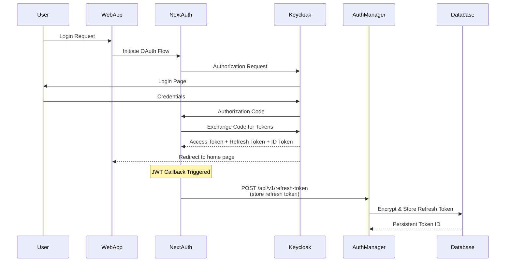
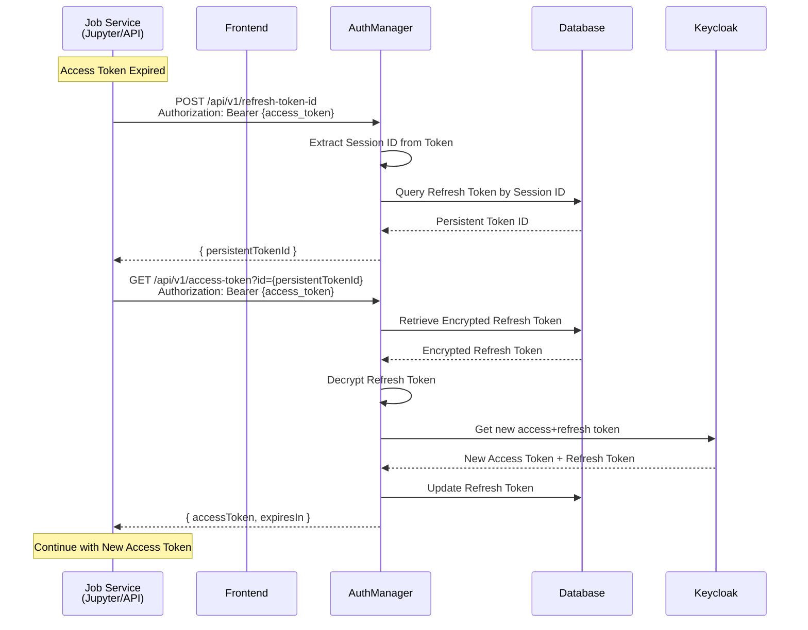
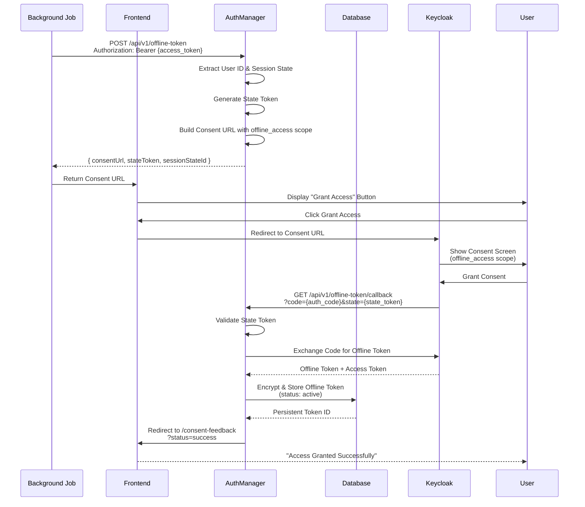
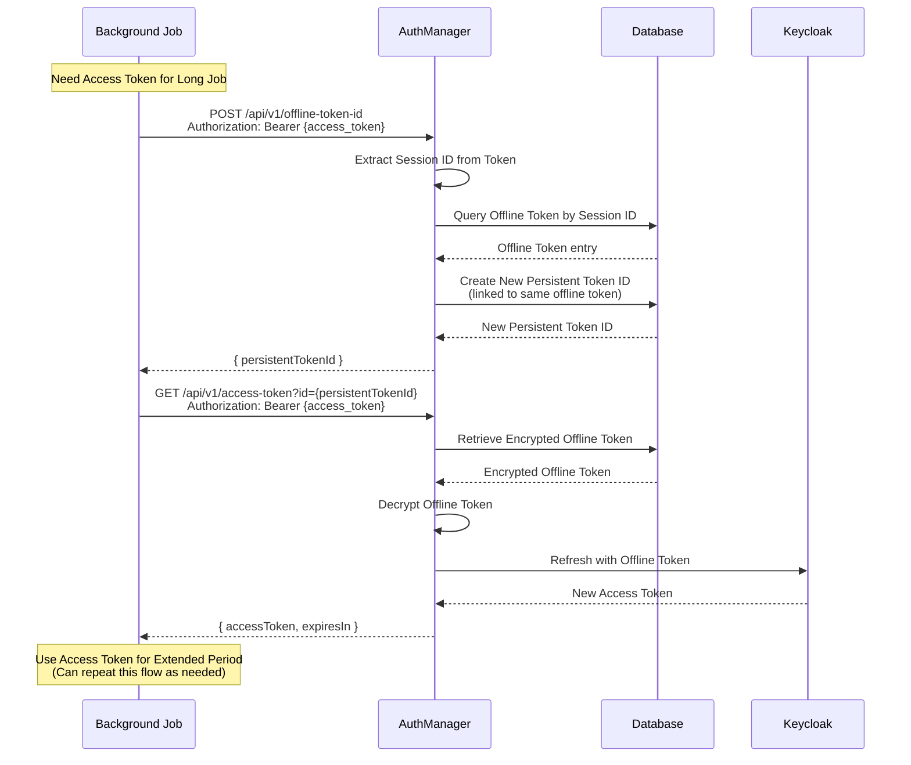
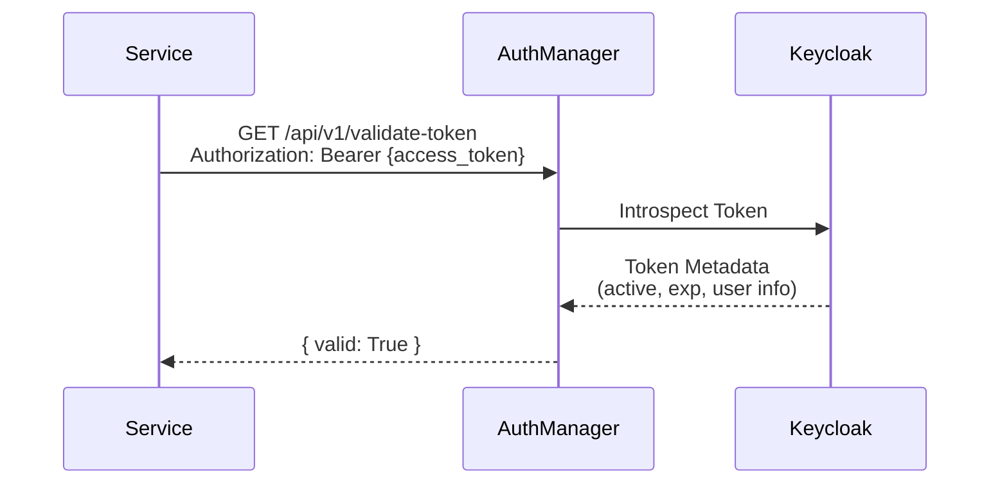
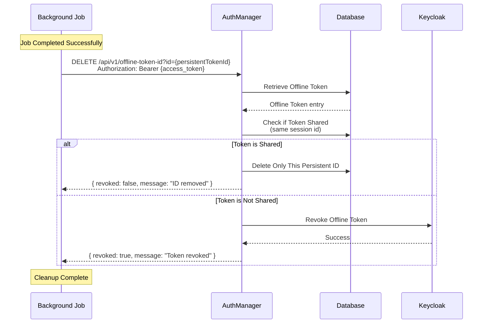

# Auth Manager Service

FastAPI microservice for managing Keycloak OAuth tokens, including refresh tokens, offline tokens, and access token generation.

## Features

- **Token Vault**: Secure storage for encrypted refresh and offline tokens
- **Access Token Generation**: Generate fresh access tokens using stored refresh/offline tokens
- **Token Validation**: Validate access tokens via Keycloak introspection
- **Offline Token Management**: Request, store, and revoke long-lived offline tokens
- **AES-256-CBC Encryption**: All tokens encrypted at rest

## Authentication Flow Architecture

### Overview

The Auth Manager service provides two distinct token management strategies:

1. **Session-based tokens** (refresh tokens) - For short to medium-running jobs
2. **Offline tokens** - For long-running background jobs requiring extended access

### Use Case 1: Initial Login & Session Token Storage

When a user logs in through the frontend, NextAuth handles the authentication and the refresh token is stored in the vault.



### Use Case 2: Short/Medium Running Jobs (Refresh Token Flow)

For jobs like Jupyter notebooks that need fresh access tokens during an active session.



### Use Case 3: Long Running Jobs (Offline Token Flow)

For background jobs that need access beyond the user's active session.

#### Step 3a: Request Offline Token Consent



#### Step 3b: Use Offline Token for Access



### Use Case 4: Token Validation



### Use Case 5: Revoke Offline Token

When a background job completes, it should clean up by revoking its offline token.



### Key Concepts

- **Persistent Token ID**: A uuid that references an encrypted token in the vault
- **Session State ID**: Keycloak session identifier used to link tokens to user sessions
- **Refresh Token**: Short-lived token (typically minutes to hours) for active sessions
- **Offline Token**: Long-lived token (days to months) for background jobs
- **Ack State Token**: Encrypted JWT used to validate OAuth callback requests

### Security Features

- All tokens encrypted at rest using AES-256-CBC
- Bearer token authentication required for all operations

## Technology Stack

- **FastAPI** 0.119.1 - Modern async web framework
- **Python** 3.12+ - Latest Python features
- **SQLAlchemy** 2.0 - Async ORM for PostgreSQL
- **Pydantic** v2 - Data validation and settings
- **UV** - Fast Python package manager
- **PostgreSQL** 18 - Token vault database
- **Keycloak** - OAuth2/OIDC provider

## Project Structure

```
auth-manager-svc/
├── app/
│   ├── api/              # API routes
│   ├── core/             # Core utilities
│   ├── db/               # Database models and repositories
│   ├── middleware/       # Custom middleware
│   ├── models/           # Pydantic models
│   └── services/         # Business logic
├── alembic/              # Database migrations
├── tests/                # Test suite
├── pyproject.toml        # Project dependencies
└── .env.example          # Environment variables template
```

## Setup

### Prerequisites

- Python 3.12+
- PostgreSQL 18
- Keycloak instance
- UV package manager

### Installation

1. Install UV (if not already installed):

```bash
curl -LsSf https://astral.sh/uv/install.sh | sh
```

2. Clone the repository and navigate to the service directory:

```bash
cd auth-manager-svc
```

3. Create a virtual environment and install dependencies:

```bash
uv venv
source .venv/bin/activate  # On Windows: .venv\Scripts\activate
make install
make install-dev
```

### Configure Environment

4. Copy the environment template and configure:

```bash
make env
# Edit .env with your configuration
```

### Generate encryption key and ack state secret and update .env

```bash
export ENCRYPTION_KEY=$(openssl rand -hex 32)
echo "AUTH_MANAGER_TOKEN_VAULT_ENCRYPTION_KEY=$ENCRYPTION_KEY" >> .env
```

```bash
export STATE_TOKEN_SECRET=$(openssl rand -base64 32)
echo "STATE_TOKEN_SECRET=$STATE_TOKEN_SECRET" >> .env
```

### Copy Keycloak client secret

```bash
1. select service realm
2. go to clients
3. select your service client (in dev env is : auth)
4. go to credentials
5. copy "Client Secret" to KEYCLOAK_CLIENT_SECRET
```

### Add redirect urls to whitelist

```bash
1. select service realm
2. go to clients
3. select your service client (in dev env is : auth)
4. add redirect url for consent to the list
5. add redirect url after consent (after granting consent) to the list
```

### Run database migrations:

```bash
make db-migrate
```

### Running the Service

Development mode with auto-reload:

```bash
make dev-local
```

## API Documentation

Once running, access the interactive API documentation:

- **Scalar UI**: http://localhost:8000/docs
- **OpenAPI JSON**: http://localhost:8000/openapi.json

## Environment Variables

See `.env.example` for all required environment variables. Key variables:

- `DATABASE_URL` - PostgreSQL connection string
- `KEYCLOAK_*` - Keycloak configuration
- `AUTH_MANAGER_TOKEN_VAULT_ENCRYPTION_KEY` - 64-char hex encryption key
- `LOG_LEVEL` - Logging level (DEBUG, INFO, WARNING, ERROR)

## Development

#### Code Formatting

```bash
make format
```

#### Linting

```bash
make lint
```

#### Type checking

```bash
make type
```

## Docker Deployment

### Quick Start with Docker Compose

```bash
# Start all services (PostgreSQL + Auth Manager)
make dev-docker

# Start with Keycloak for local development
make dev-local

# Stop services
make down
```

### Production Docker Build

```bash
# Build the image
make bake
```

```bash
# Deploy the image
make deploy
```

## Database Migrations

Migrations run automatically on container startup. For manual control:

```bash
# Run migrations
make db-migrate

# Create new migration
make db-revision MESSAGE="description"
```

## Health Checks

- **Liveness**: `GET /health` - Returns service status
- **Readiness**: `GET /health/ready` - Checks database connectivity
- **Version**: `GET /version` - Checks app tools versions

Copyright © 2025 Open Brain Institute
